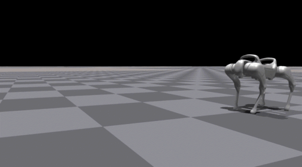

  

Full docu please check: https://developer.bywerks.com/mission-development/bysensesim

# bysenseSim: Build Your Own Quadruped Robot Missions with bysense

## Mission

Our mission is to bring sensors to walk. 

bysenseSim is an open toolset designed to help you gain your first experience with bysense. Built on Gazebo, ROS2, and RViz, it offers a complete simulation environment to get bysense up and running before the need for physical hardware. Whether you’re a beginner wanting to dive into robotics or an experienced developer looking to build complex applications, this repo has what you need to get started quickly and efficiently to enable sensors to walk using reinforcement learning (RL) policies:

  

With bysenseSim, you can explore and develop robotic behaviors in a realistic simulation environment—no physical hardware required.

## Why bysenseSim?

We have been looking for multiple repos online and did not find a single complete repo for ROS2, Gazebo and a walking quadruped. We provide the base for you to experiment to build your first missions with bysense.

## Features

We’re bringing bysense to Gazebo/ROS2, complete with following key capabilities to build your missions:

Use the standup.py script to bring the robot in its ready to walk position:

  

With the walking.py you find a basic kinematic movement of the robot:

  

Finally once your are finished with your simulation sitdown:

  

Find the full docu on: https://developer.bywerks.com/mission-development/bysensesim

Contact: welcome@bywerks.com
discord server: https://discord.gg/3cqSVjfBsY

